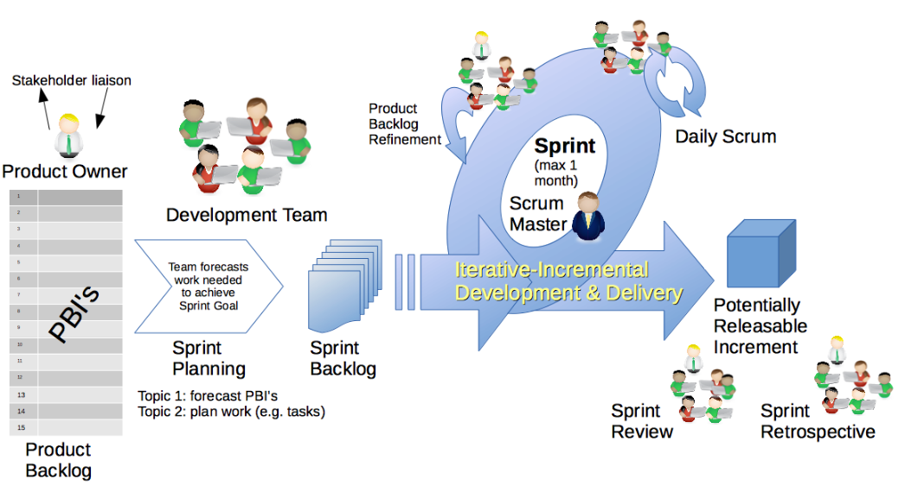

# What is Scrum?

If you are just getting started, think of Scrum as a way to get work done as a team in small pieces at a time, with continuous experimentation and feedback loops along the way to learn and improve as you go. Scrum helps people and teams *deliver value* incrementally in a collaborative way. As *an agile framework*, Scrum provides just enough structure for people and teams to integrate into how they work, while adding the right practices to optimize for their specific needs.  **You may be thinking, that sounds great! But, how do I get started?**

It starts with understanding the Scrum framework which is defined in The Scrum Guide and was first introduced to the world in 1995 as a better way of team collaboration for solving complex problems.  The Scrum framework is fairly simple being made up of a **Scrum Team** consisting of a **Product Owner**, a **Scrum Master** and **Developers**, each of which have specific accountabilities. The Scrum Team takes part in *five events* and produces *three artifacts*. Scrum co-creators Ken Schwaber and Jeff Sutherland wrote and maintain The Scrum Guide, which explains Scrum clearly and succinctly.  The guide contains the definition of Scrum,  describing the Scrum accountabilities, events, artifacts and the guidance that binds them together. 

## Scrum Values
- Courage
- Focus
- Committment
- Respect
- Openness

## Workflow

1. Sprint.
1. Sprint Planning.
1. Daily Scrum.
1. Post Sprint Events.
1. Backlog Refinement.

## Scrum.Org

[link to Scrum.org](https://www.scrum.org/)

## Scrum Process

## Artifacts

| Artifact Name | Artifact Frequency |
| ------------- | ------------------ |
| Product backlog| Continuous  |
| Sprint backlog | Each Sprint |
| Burndown Chart | Each sprint |
| Release Burnup | Each Release |

### End of File

