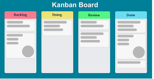
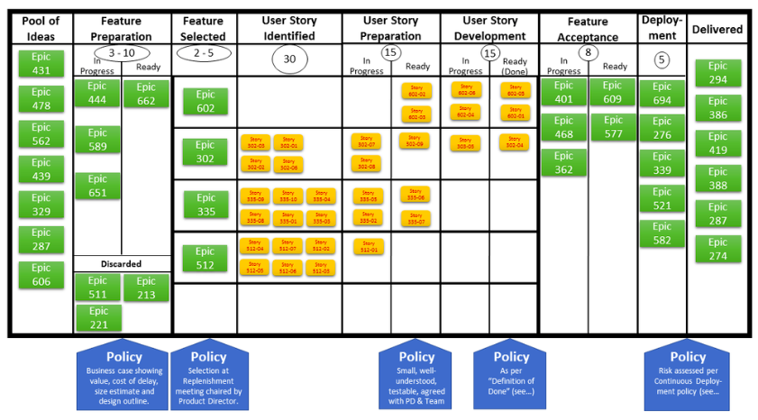

Kanban Method of Software Project Management
********************************************

Kanban, meaning signboard or billboard is a scheduling system for lean manufacturing (also called just-in-time manufacturing, abbreviated JIT.Taiichi Ohno, an industrial engineer at Toyota, developed kanban to improve manufacturing efficiency.[3] The system takes its name from the cards that track production within a factory. Kanban is also known as the Toyota nameplate system in the automotive industry.

In kanban, problem areas are highlighted by measuring lead time and cycle time of the full process and process steps.[4] One of the main benefits of kanban is to establish an upper limit to work in process (commonly referred as "WIP") inventory to avoid overcapacity.

**Origins** 

The system originates from the simplest visual stock replenishment signaling system, an empty box. This was first developed in the UK factories producing Spitfires during the Second World War, and was known as the "*two bin system*".In the late 1940s, Toyota started studying supermarkets with the idea of applying shelf-stocking techniques to the factory floor. In a supermarket, customers generally retrieve what they need at the required time—no more, no less. Furthermore, the supermarket stocks only what it expects to sell in a given time, and customers take only what they need, because future supply is assured. This observation led Toyota to view a process as being a customer of one or more preceding processes and to view the preceding processes as a kind of store.

Kanban aligns inventory levels with actual consumption. A *signal* tells a supplier to produce and deliver a new shipment when a material is consumed. This *signal* is tracked through the replenishment cycle, bringing visibility to the supplier, consumer, and buyer.

** Kanban Implementation **

+ The workflow consists of logical steps.
+ There are two steps to a workflow viz. queue and work in progress/process.
+ The team in charge decides on the maximum amount of work each step of the workflow can hold.
+ Work is pushed into the queue step and pulled into the process step.
+ If need be, work is halted in two successive stages to clear bottleneck.

**Toyota's Six Rules**

#. Each process issues requests (kanban) to its suppliers when it consumes its supplies.
#. Each process produces according to the quantity and sequence of incoming requests.
#. No items are made or transported without a request.
#. The request associated with an item is always attached to it.
#. Processes must not send out defective items, to ensure that the finished products will be defect-free.
#. Limiting the number of pending requests makes the process more sensitive and reveals inefficiencies.

**Link to Kanban Website**

This is a `Wikipedia link to Kanban`_
.. _`link to Google`: https://en.wikipedia.org/wiki/Kanban

**A Kanban Board**

**Kanban Board in Software Development**

+-------------------------+------------------------------------------------------------------------------+
| Kanban Board Column     | Kanban Board Column Policy                                                   |
+=========================+==============================================================================+
|Pool of Ideas            | Not Applicable                                                               |
+-------------------------+------------------------------------------------------------------------------+
|Feature Preparation      | Business case showing value, cost of delay, size estimate and design outline |
+-------------------------+------------------------------------------------------------------------------+
|Feature Selected         | Selection at meeting chaired by product director                             |
+-------------------------+------------------------------------------------------------------------------+
|User Story Identified    | Not Applicable                                                               |
+-------------------------+------------------------------------------------------------------------------+
|User Story Preparation   | Small, testable, well understood and agreed by PD and team                   |
+-------------------------+------------------------------------------------------------------------------+
|User Story Development   | As per Definiton of Done                                                     |
+-------------------------+------------------------------------------------------------------------------+
|Feature Acceptance       | Not Applicable                                                               |
+-------------------------+------------------------------------------------------------------------------+
|Deployment               | Risk assessed per Conitnuous Deployment policy                               |
+-------------------------+------------------------------------------------------------------------------+
|Delivered                | Risk assessed per Conitnuous Deployment policy                               |
+-------------------------+------------------------------------------------------------------------------+

*End of File*
